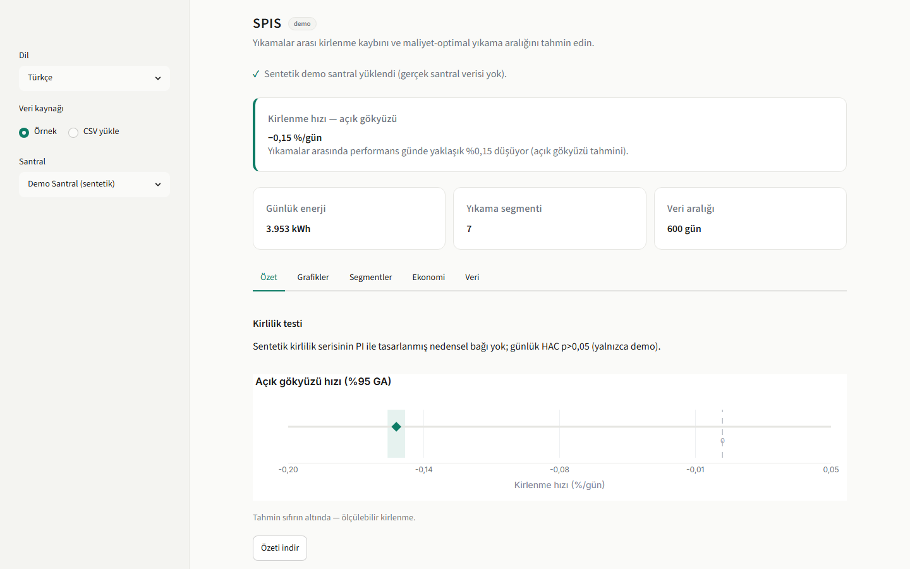

# SPIS — Solar Performance Improvement System

SPIS turns solar-plant operating data into clear soiling-loss estimates and an economically informed panel-washing schedule.

> **Data confidentiality:** Raw Enerjisa SCADA and washing logs are proprietary and are
> not included in this public repository. Bundled real-site examples use only public
> external data. See [DATA_USE.md](DATA_USE.md) for licensing, reuse rules, and
> partner-permission notes.

[](https://github.com/ErenAta16/Tubitak-EnerjiSA-SPIS/actions/workflows/ci.yml)
[](https://www.python.org/)
[](LICENSE)
[](https://streamlit.io/)

**Live demo:** deployment is pending. The complete public-data dashboard runs locally with the quickstart below.



### Quickstart

```bash
git clone https://github.com/ErenAta16/Tubitak-EnerjiSA-SPIS.git
cd Tubitak-EnerjiSA-SPIS
pip install -r requirements-streamlit.txt && streamlit run app/streamlit_app.py
```

## Product

The Streamlit app is a working, bilingual interface for exploring the synthetic demo,
two bundled public real sites, or a user-supplied daily CSV. It provides:

- headline clear-sky soiling rate and uncertainty;
- production, irradiation, performance-index, and segment charts;
- an inter-wash segment table with data-quality context;
- an interactive washing-cost and electricity-price optimizer;
- a downloadable Markdown summary; and
- English and Turkish display modes.

The public demo includes two real, openly licensed comparison sites (NREL PVDAQ 2107
and DKASC, Alice Springs) validated in the project's external-validation study, in
addition to the synthetic Demo Plant. Enerjisa's own plant data remains proprietary
and is not published pending partner permission (see [DATA_USE.md](DATA_USE.md)).

All three bundled options load from `data/examples/`. The Enerjisa Canakkale option
appears only when its gitignored local `data/processed/` output exists.

### Run and deploy

Run the app from the repository root:

```bash
pip install -r requirements-streamlit.txt
streamlit run app/streamlit_app.py
```

For Streamlit Community Cloud, select this repository and set the main file to
`app/streamlit_app.py`, Python to 3.12, and dependencies to
`requirements-streamlit.txt`. No secrets are required for the bundled examples.

### Setup files

- `requirements.txt` contains the core analysis, test, and lint dependencies.
- `requirements-streamlit.txt` contains the deployable web-app dependency set.
- `requirements-bench.txt` contains the optional RdTools comparison dependency.
- `requirements.lock` records the frozen core environment snapshot used for reproducibility.

See [CONTRIBUTING.md](CONTRIBUTING.md) for the test, lint, and verification workflow.

### Repository layout

```text
app/                Streamlit product and presentation layer
src/spis/           Analysis library, data loaders, models, and reports
data/examples/      Synthetic and public real-site demo snapshots
data/raw/           Proprietary plant inputs (local and gitignored)
data/processed/     Generated analysis tables (local and gitignored)
reports/            Research reports and publication figures
docs/               Product, data, and methodology documentation
scripts/            Verification and screenshot utilities
tests/              Unit and product tests
```

## Research methodology & findings

SPIS asks how quickly environmental soiling degrades irradiance-normalized PV
performance between washes, and which washing interval minimizes total cost.

### Headline findings

- **Soiling rate (Canakkale):** the clear-sky pooled estimate is **-0.125 %/day**;
  seasonal loss is modest and is not explained by daily pollution at the available
  grid or ground-station resolution.
- **Optimal wash interval:** **99 days** using real 2023 EPIAS PTF and an assumed wash
  cost. The true optimum may be shorter if the reference irradiance sensor co-soils.
- **Pollution vs performance:** daily HAC tests are null with both CAMS and in-situ
  ground PM10 for the accumulated-pollution specification.
- **Site comparison:** provisional Balikesir coordinates are not consistently cleaner
  than Canakkale in gridded CAMS data; the proposal premise is not supported at the
  placeholder location.
- **Inverters:** INV2 ranks lowest against the daily peer median on meaningful-
  irradiance days. This is descriptive screening, not fault diagnosis.
- **Machine learning:** a 15-model panel across five algorithm families was evaluated
  with blocked time-series cross-validation. None reliably beat a simple physical
  soiling-trend baseline, so ML is not used for scheduling.

### Data sources

| Source | Role | Access |
|---|---|---|
| Enerjisa SCADA workbooks and washing logs | Production, irradiation, downtime, washing | Proprietary; local only |
| NASA POWER | Weather and clear-sky baselines | Public API |
| Open-Meteo / CAMS | Gridded air-quality context | Public API |
| Turkish national air-quality network | Ground PM10/PM2.5 cross-check | Public session form |
| EPIAS PTF CSV | 2023 electricity price for economic optimization | Public export |
| NREL/OEDI PVDAQ 2107 | Real-site comparison snapshot | Public archive |
| DKASC Alice Springs array 14 | Real-site comparison snapshot | Public download |

Precise Canakkale coordinates must be supplied locally through `PLANT_LAT` and
`PLANT_LON` in `.env`; public defaults are intentionally coarse.

### Reproducible pipeline

Install the core environment and execute the complete pipeline:

```bash
python -m venv .venv
# Windows: .venv\Scripts\activate
# Linux/macOS: source .venv/bin/activate
pip install -e .
pip install -r requirements.txt
python -m spis.run --stage all
```

Individual stages are available for `ingest`, `clean`, `soiling`, `robustness`,
`optimize`, `ml`, `report`, `site_comparison`, `inverter_anomaly`, `field_visit`,
`external_validation`, `pvdaq_validation`, and `method_benchmark`.

The core method filters downtime and low-irradiance observations, temperature-corrects
the performance index, fits robust inter-wash Theil-Sen trends, tests clear-sky and
pollution sensitivity, and propagates the resulting soiling-rate uncertainty into the
economic optimizer. Full assumptions and limitations are documented in the
[reports index](docs/INDEX.md).

### Quality gates

```bash
make lint
make test
make verify
```

The verification suite checks reproducible artifacts, confidentiality safeguards,
canonical soiling results, and product behavior. Raw inputs are required only for
integration stages that rebuild proprietary plant outputs.

### Releases

- **v1.1** — aligns pollution validation, leakage-controlled machine learning, and the
  multi-family model comparison with the current reports.
- **v1.0** — first packaged research deliverable with multi-site support, ground-air-
  quality cross-checks, and one-command reproducibility.
